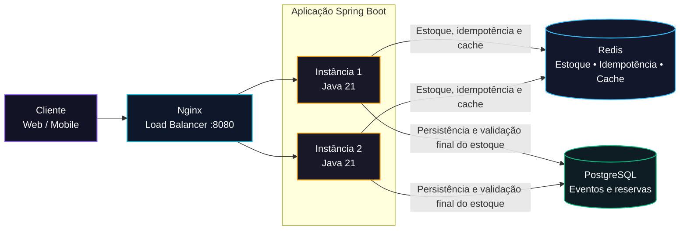

# 1. Topologia da Aplicação

Visão geral dos componentes e de como as requisições passam pela aplicação.

```mermaid
flowchart LR
    classDef clientBox fill:#121324,stroke:#8b5cf6,stroke-width:1.5px,color:#f8fafc;
    classDef ingressBox fill:#0f172a,stroke:#06b6d4,stroke-width:1.5px,color:#f8fafc;
    classDef appBox fill:#181829,stroke:#f59e0b,stroke-width:1.5px,color:#f8fafc;
    classDef redisBox fill:#13172c,stroke:#38bdf8,stroke-width:1.5px,color:#f8fafc;
    classDef pgBox fill:#0e1d24,stroke:#10b981,stroke-width:1.5px,color:#f8fafc;

    CLIENT["Cliente<br/>Web / Mobile"]:::clientBox
    NGINX["Nginx<br/>Load Balancer :8080"]:::ingressBox

    subgraph APP["Aplicação Spring Boot"]
        APP1["Instância 1<br/>Java 21"]:::appBox
        APP2["Instância 2<br/>Java 21"]:::appBox
    end

    REDIS[("Redis<br/>Estoque • Idempotência • Cache")]:::redisBox
    POSTGRES[("PostgreSQL<br/>Eventos e reservas")]:::pgBox

    CLIENT --> NGINX
    NGINX --> APP1
    NGINX --> APP2
    APP1 -->|"Estoque, idempotência e cache"| REDIS
    APP2 -->|"Estoque, idempotência e cache"| REDIS
    APP1 -->|"Persistência e validação final do estoque"| POSTGRES
    APP2 -->|"Persistência e validação final do estoque"| POSTGRES
```
