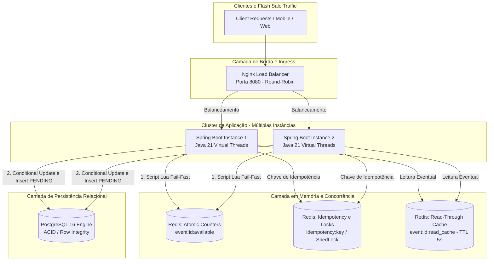

# 1. Topologia de Infraestrutura e Alta Disponibilidade

Este documento detalha o desenho de rede, roteamento e distribuição de carga entre instâncias.

```mermaid
graph TB
    subgraph Clients["Clientes e Flash Sale Traffic"]
        C1["Client Requests / Mobile / Web"]
    end

    subgraph ReverseProxy["Camada de Borda e Ingress"]
        LB["Nginx Load Balancer<br/>Porta 8080 - Round-Robin"]
    end

    subgraph ServiceCluster["Cluster de Aplicação - Múltiplas Instâncias"]
        APP1["Spring Boot Instance 1<br/>Java 21 Virtual Threads"]
        APP2["Spring Boot Instance 2<br/>Java 21 Virtual Threads"]
    end

    subgraph FastPath["Camada em Memória e Concorrência"]
        R_STOCK[("Redis: Atomic Counters<br/>event:id:available")]
        R_LOCK[("Redis: Idempotency e Locks<br/>idempotency:key / ShedLock")]
        R_CACHE[("Redis: Read-Through Cache<br/>event:id:read_cache - TTL 5s")]
    end

    subgraph PersistentStorage["Camada de Persistência Relacional"]
        PG[("PostgreSQL 16 Engine<br/>ACID / Row Integrity")]
    end

    C1 --> LB
    LB -->|Balanceamento| APP1
    LB -->|Balanceamento| APP2

    APP1 -->|1. Script Lua Fail-Fast| R_STOCK
    APP2 -->|1. Script Lua Fail-Fast| R_STOCK
    
    APP1 -->|Chave de Idempotência| R_LOCK
    APP2 -->|Chave de Idempotência| R_LOCK

    APP1 -->|Leitura Eventual| R_CACHE
    APP2 -->|Leitura Eventual| R_CACHE

    APP1 -->|2. Conditional Update e Insert PENDING| PG
    APP2 -->|2. Conditional Update e Insert PENDING| PG
```