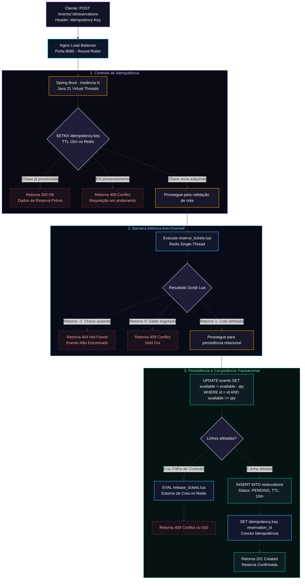

# 2. Fluxo Crítico de Reserva e Barreira Anti-Oversell

Detalhamento da máquina de decisão transacional executada no endpoint `POST /events/:id/reservations`.

```mermaid
flowchart TD
    classDef clientBox fill:#121324,stroke:#8b5cf6,stroke-width:1.5px,color:#f8fafc;
    classDef ingressBox fill:#0f172a,stroke:#06b6d4,stroke-width:1.5px,color:#f8fafc;
    classDef appBox fill:#181829,stroke:#f59e0b,stroke-width:1.5px,color:#f8fafc;
    classDef redisBox fill:#13172c,stroke:#38bdf8,stroke-width:1.5px,color:#f8fafc;
    classDef pgBox fill:#0e1d24,stroke:#10b981,stroke-width:1.5px,color:#f8fafc;
    classDef decisionBox fill:#1e1e38,stroke:#cbd5e1,stroke-width:1.5px,color:#ffffff;
    classDef failBox fill:#1a111a,stroke:#f43f5e,stroke-dasharray: 4 4,color:#fca5a5;

    START["Cliente: POST /events/:id/reservations<br/>Header: Idempotency-Key"]:::clientBox
    NGINX["Nginx Load Balancer<br/>Porta 8080 - Round-Robin"]:::ingressBox
    API["Spring Boot - Instância N<br/>Java 21 Virtual Threads"]:::appBox

    START --> NGINX
    NGINX --> API

    subgraph S1 ["1. Controle de Idempotência"]
        API --> IDEM_CHECK{"SETNX idempotency:key<br/>TTL 15m no Redis"}:::decisionBox
        IDEM_CHECK -->|Chave já processada| RET_CACHE["Retorna 200 OK<br/>Dados da Reserva Prévia"]:::failBox
        IDEM_CHECK -->|Em processamento| RET_CONF["Retorna 409 Conflict<br/>Requisição em andamento"]:::failBox
        IDEM_CHECK -->|Chave nova adquirida| S2_ENTRY["Prossegue para validação de cota"]:::appBox
    end

    subgraph S2 ["2. Barreira Atômica Anti-Oversell"]
        S2_ENTRY --> LUA["Executa reserve_tickets.lua<br/>Redis Single-Thread"]:::redisBox
        LUA --> LUA_CHECK{"Resultado Script Lua"}:::decisionBox
        LUA_CHECK -->|Retorno -1: Chave ausente| RET_404["Retorna 404 Not Found<br/>Evento Não Encontrado"]:::failBox
        LUA_CHECK -->|Retorno 0: Saldo esgotado| RET_409["Retorna 409 Conflict<br/>Sold Out"]:::failBox
        LUA_CHECK -->|Retorno 1: Cota debitada| S3_ENTRY["Prossegue para persistência relacional"]:::appBox
    end

    subgraph S3 ["3. Persistência e Consistência Transacional"]
        S3_ENTRY --> SQL_UPDATE["UPDATE events SET available = available - qty<br/>WHERE id = id AND available >= qty"]:::pgBox
        SQL_UPDATE --> DB_CHECK{"Linhas afetadas?"}:::decisionBox
        
        DB_CHECK -->|0 ou Falha de Conexão| ROLLBACK["EVAL release_tickets.lua<br/>Estorno de Cota no Redis"]:::redisBox
        ROLLBACK --> RET_ERR["Retorna 409 Conflict ou 500"]:::failBox

        DB_CHECK -->|1 linha afetada| SQL_INSERT["INSERT INTO reservations<br/>Status: PENDING, TTL: 10m"]:::pgBox
        SQL_INSERT --> REDIS_FIN["SET idempotency:key reservation_id<br/>Conclui Idempotência"]:::redisBox
        REDIS_FIN --> SUCCESS["Retorna 201 Created<br/>Reserva Confirmada"]:::pgBox
    end

    style S1 fill:#090a14,stroke:#8b5cf6,stroke-width:1px,color:#c4b5fd;
    style S2 fill:#080c18,stroke:#38bdf8,stroke-width:1px,color:#7dd3fc;
    style S3 fill:#061314,stroke:#10b981,stroke-width:1px,color:#6ee7b7;
```