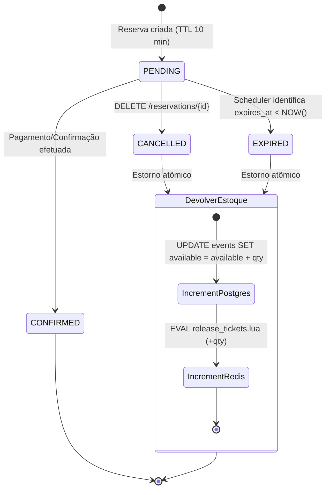

# 3. Ciclo de Vida da Reserva e Expiração Distribuída

Detalhamento das transições de status da reserva (`PENDING`, `CONFIRMED`, `CANCELLED`, `EXPIRED`) e rotina do ShedLock.

```mermaid
stateDiagram-v2
    [*] --> PENDING: Reserva criada (TTL 10 min)
    
    PENDING --> CONFIRMED: Pagamento/Confirmação efetuada
    PENDING --> CANCELLED: DELETE /reservations/{id}
    PENDING --> EXPIRED: Scheduler identifica expires_at < NOW()

    CANCELLED --> DevolverEstoque: Estorno atômico
    EXPIRED --> DevolverEstoque: Estorno atômico

    state DevolverEstoque {
        [*] --> IncrementPostgres: UPDATE events SET available = available + qty
        IncrementPostgres --> IncrementRedis: EVAL release_tickets.lua (+qty)
        IncrementRedis --> [*]
    }

    CONFIRMED --> [*]
    DevolverEstoque --> [*]
```